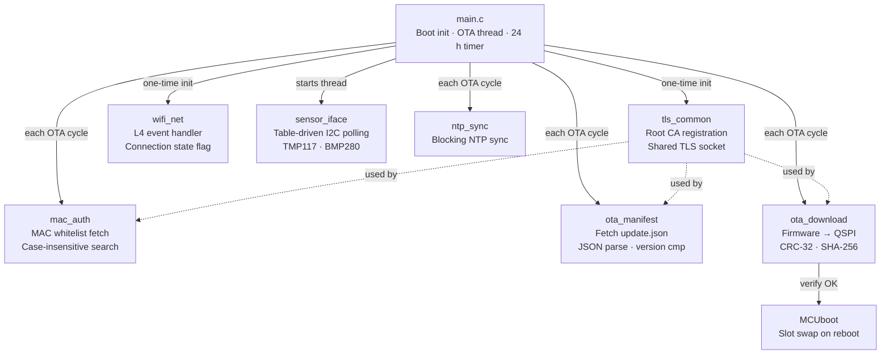
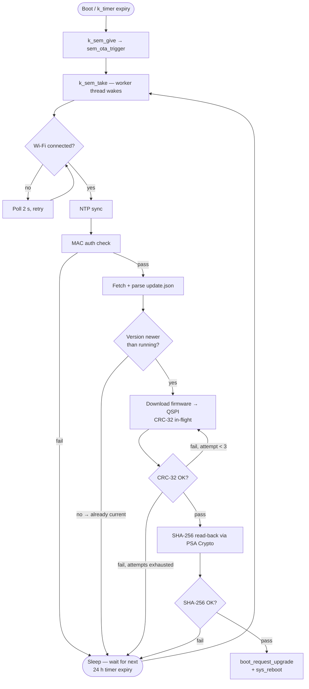
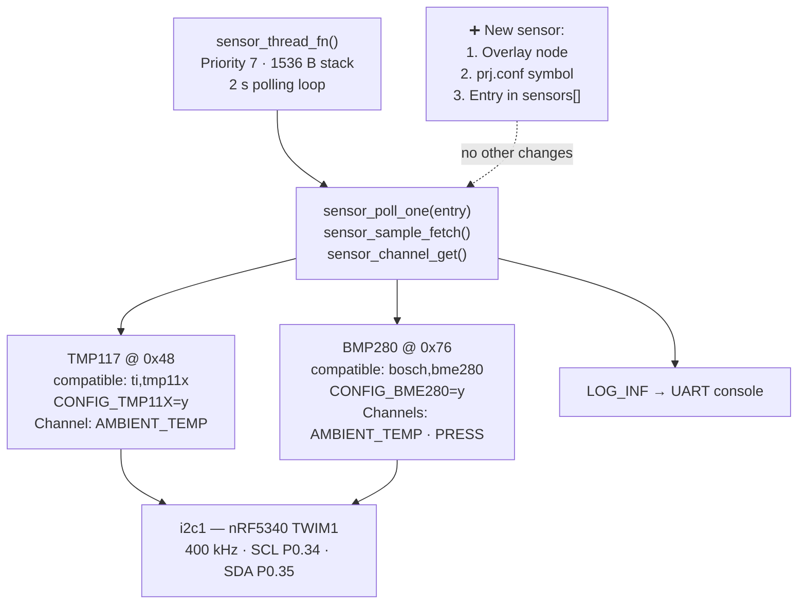

# Nordic_OTA_Application

> Zephyr/NCS OTA firmware client for nRF7002DK — Wi-Fi + MCUboot dual-slot updates with MAC-whitelist auth, periodic 24 h update checks, and a table-driven I2C sensor subsystem (TMP117 + BMP280).

**Target:** `nrf7002dk/nrf5340/cpuapp` &nbsp;|&nbsp; **NCS:** v3.2.4 / Zephyr 4.2.99 &nbsp;|&nbsp; **MCUboot:** dual-slot QSPI

---

## Table of Contents

- [Overview](#overview)
- [Architecture](#architecture)
- [OTA Scheduling Flow](#ota-scheduling-flow)
- [Sensor Subsystem](#sensor-subsystem)
- [Module Map](#module-map)
- [Build](#build)
- [OTA Server Setup](#ota-server-setup)
- [Adding a New I2C Sensor](#adding-a-new-i2c-sensor)
- [Known Gotchas](#known-gotchas)

---

## Overview

The device boots, connects to Wi-Fi, and immediately runs the full OTA pipeline.
After that, a kernel timer fires every 24 hours to repeat the check automatically.
Whether the run succeeds, finds no update, or fails after retries, the worker thread
always sleeps for the full next interval before trying again — no shortened backoff.

In parallel, a dedicated sensor thread polls TMP117 (temperature) and BMP280
(temperature + pressure) over I2C every 2 seconds and logs readings to the UART
console via `LOG_INF`.

**Full OTA pipeline per cycle:**

1. Confirm Wi-Fi + DHCP are up (polls `wifi_net_is_connected()` non-blockingly)
2. NTP time sync — required for TLS certificate `notBefore`/`notAfter` validation
3. MAC-address whitelist check against a GitHub-hosted JSON file over TLS
4. HTTPS fetch of `update.json` — parses 5 fields: `version`, `fw_path`, `file_size`, `sha256`, `crc32`
5. Semver version compare — skip the rest if already up to date
6. HTTPS download of firmware binary streamed directly to QSPI secondary slot, CRC-32 computed in-flight
7. CRC-32 verification against manifest, then SHA-256 read-back from QSPI via PSA Crypto
8. `boot_request_upgrade(BOOT_UPGRADE_TEST)` + `sys_reboot()` — MCUboot swaps slots on next boot
   > New image must call `boot_set_confirmed()` or MCUboot reverts on watchdog timeout.

Steps 6–8 retry from byte 0 up to `OTA_MAX_DOWNLOAD_ATTEMPTS` (default 3) times on any failure.

---

## Architecture



---

## OTA Scheduling Flow



---

## Sensor Subsystem



**Adding a sensor never touches `sensor_poll_one()` or the thread** — it only grows the
`sensors[]` table in `sensor_iface.c`. See [Adding a New I2C Sensor](#adding-a-new-i2c-sensor).

---

## Module Map

| Module | File(s) | Responsibility |
|---|---|---|
| Orchestrator | `main.c` | One-time boot init, OTA worker thread, 24 h `k_timer`, `sem_ota_trigger` semaphore |
| TLS | `tls_common.{c,h}` | ISRG Root X1 CA registration, shared `tls_common_open_socket()` |
| Wi-Fi | `wifi_net.{c,h}` | `NET_EVENT_L4_*` callback, `wifi_net_is_connected()` persistent flag |
| NTP | `ntp_sync.{c,h}` | `date_time_update_async()` wrapper, blocks with configurable timeout |
| MAC auth | `mac_auth.{c,h}` | Fetches `allowed_macs.json`, case-insensitive MAC search |
| Manifest | `ota_manifest.{c,h}` | HTTPS GET `update.json`, `json_obj_parse()`, 5-field bitmask validation, semver compare |
| Download | `ota_download.{c,h}` | HTTPS GET firmware → `stream_flash` → QSPI, CRC-32, SHA-256 PSA read-back |
| Sensors | `sensor_iface.{c,h}` | Table-driven `sensor_sample_fetch()` loop, `LOG_INF` output |

---

## Build

```bash
# First build
west build -b nrf7002dk/nrf5340/cpuapp .
west flash

# Clean rebuild (required after any prj.conf or .overlay change)
rmdir /s /q build          # Windows
# rm -rf build             # Linux/macOS
west build -b nrf7002dk/nrf5340/cpuapp .
```

> **Testing interval:** `OTA_INTERVAL` in `main.c` is currently `K_MINUTES(2)`.
> Change to `K_HOURS(24)` before production deployment.

---

## OTA Server Setup

`update.json` and the firmware binary are served from GitHub raw content
(`raw.githubusercontent.com`). The paths are defined in `ota_manifest.c`
(`MANIFEST_PATH`) and are referenced by `fw_path` in the JSON itself.

### `update.json` schema

```json
{
  "version":   "1.1.0",
  "fw_path":   "/YourUser/YourRepo/main/firmware_v1.1.0.bin",
  "file_size": 294912,
  "sha256":    "a3f1...64 hex chars",
  "crc32":     "1a2b3c4d"
}
```

### Publishing a new release

1. Build the target firmware image.
2. Locate the signed binary (typically `build/zephyr/app_update.bin`).
3. Compute SHA-256 and CRC-32 of that binary.
4. Upload the binary to the GitHub path `fw_path` will reference.
5. Edit `update.json`: bump `version`, update `file_size`, `sha256`, `crc32`, `fw_path`.
6. Devices pick it up on their next scheduled OTA check.

### `allowed_macs.json` schema

```json
{
  "allowed_macs": [
    "AA:BB:CC:DD:EE:FF",
    "11:22:33:44:55:66"
  ]
}
```

The device's MAC is logged at boot (`LOG_INF`) so you can copy-paste it directly
into this file when enrolling a new board.

---

## Adding a New I2C Sensor

Three steps — `sensor_poll_one()` and the thread never change.

**1. Devicetree overlay** (`nrf7002dk_nrf5340_cpuapp.overlay`) — add a child node
under `&i2c1`, copying either existing block as a template:

```dts
your_sensor: your_sensor@ADDRESS {
    compatible = "vendor,part-name";   /* exact string from the driver .yaml binding */
    reg = <0xADDRESS>;
    status = "okay";
};
```

**2. `prj.conf`** — enable the driver Kconfig symbol:

```
CONFIG_YOUR_SENSOR_SYMBOL=y
```

> Check `zephyr/drivers/sensor/<vendor>/<part>/Kconfig` in your NCS install
> for the exact symbol name — it often differs from the chip name.

**3. `sensor_iface.c`** — add a channel spec array and one table entry:

```c
static const struct sensor_channel_spec your_channels[] = {
    { SENSOR_CHAN_AMBIENT_TEMP, "Temp", "C" },
    /* add more channels from enum sensor_channel as needed */
};

/* in sensors[]: */
{
    .name         = "YOUR_SENSOR",
    .dev          = DEVICE_DT_GET(DT_NODELABEL(your_sensor)),
    .channels     = your_channels,
    .num_channels = ARRAY_SIZE(your_channels),
},
```

---

## Known Gotchas

| # | Issue | Fix |
|---|---|---|
| 1 | **Kconfig symbol ≠ chip name** | TMP116/117/119 → `CONFIG_TMP11X`. Always check the actual `Kconfig` file under `drivers/sensor/<vendor>/` in your NCS install. |
| 2 | **`compatible = "i2c-device"` is not a driver match** | Must be the exact string from the driver's `.yaml` binding file. Wrong value → linker error `undefined reference to __device_dts_ord_N`. |
| 3 | **Overlay macros need `#include`** | `I2C_BITRATE_FAST` won't expand without `#include <zephyr/dt-bindings/i2c/i2c.h>`. Use the literal `<400000>` instead. |
| 4 | **`wifi_net_wait_connected()` is one-shot** | Consumes a semaphore that fires only on connect events. Never call it from the periodic OTA thread — use `wifi_net_is_connected()` for repeated polling. |
| 5 | **Stale build cache hides Kconfig edits** | After any `prj.conf` or `.overlay` change, delete `build/` and do a clean rebuild. Incremental builds re-merge the old cached config. |
| 6 | **`boot_set_confirmed()` required** | After a successful OTA reboot, the new image must call `boot_set_confirmed()` or MCUboot will revert to the previous image on next watchdog reset. |
